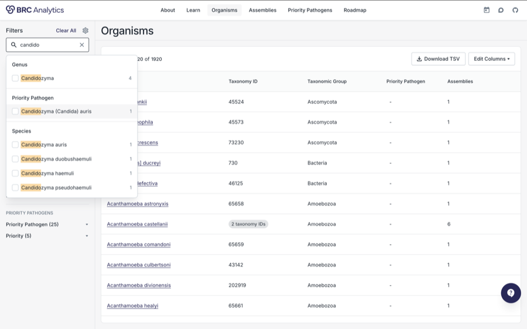

<!-- Built from PLAN.md. 16 slides / 15 minutes. -->

<!-- _class: title -->

```brandbar
https://brc-analytics.org/logo/brc.svg | 28 | invert
```

ASV 2026 {.badge}

# BRC-Analytics: A free, universally accessible environment for analysis of viral data

## The future is agentic {.nocaps}

::: presenter
Anton Nekrutenko | Penn State | [galaxyproject.org](https://galaxyproject.org)
:::

::: figure src="assets/qr/asv26.svg" href="https://gxy.io/asv26" bare .qr-pin
gxy.io/asv26
:::

BRCs = BV-BRC ([bv-brc.org](https://www.bv-brc.org/)) + PDN ([pathogendatanetwork.org](https://pathogendatanetwork.org/)) + BRC-analytics ([brc-analytics.org](https://brc-analytics.org)) {.footnote}

---

<!-- _class: compact agenda -->

# Outline

A 15 min impossible challenge

- What is BRC-Analytics
- What is Galaxy
- What are agentic analyses
- Teaser: Logan / Search Entire SRA

---

<!-- _class: compact middle bigtitle -->

# BRC-Analytics: data, tools, workflows, infrastructure

[brc-analytics.org](https://brc-analytics.org)

::: pillars brace="Agents" accent=amber size=xl
### Data {accent=sky}

NCBI Datasets · NCBI Virus · EBI · UCSC Genome Browser

### Tools + Workflows {accent=emerald}

BioConda · BioContainers · Workflows

### Compute and Storage {accent=indigo}

TACC · IU JetStream2 · ACCESS-CI
:::

---

<!-- _class: micro -->

# BRC-Analytics flow

[brc-analytics.org](https://brc-analytics.org)

::: cards cols=3 gap=14px size=xs thumb=120px
### Find organism {tag="1" accent=sky}

Pick from 1,920 taxa.



### Select genome {tag="2" accent=emerald}

Choose among 5,060 assemblies.


### Select workflow {tag="3" accent=indigo}

Best-practice, community-maintained.


### Select data {tag="4" accent=amber}

Anything in the SRA, or your own.


### Run workflow {tag="5" accent=purple}

One sample or a million.


### Interpret {tag="6" accent=rose}

Inspect, iterate, publish.


:::

---

<!-- _class: micro -->

# Examples of workflows

available at [brc-analytics.org](https://brc-analytics.org)

::: cols cols=2 gap=16px
::: figure src="images/variant-calling-workflow-card.png" bare
:::

+++

::: figure src="images/influenza-a-subtyping-workflow-card.png" bare
:::

+++

::: figure src="images/pox-virus-amplicon-workflow-card.png" bare
:::

+++

::: figure src="images/capheine-workflow-card.png" bare
:::
:::

---

<!-- _class: micro -->

# An example workflow

Also see [iwc.galaxyproject.org](https://iwc.galaxyproject.org/)

::: figure src="images/influenza-a-workflow-diagram.png" h=525px bare
:::

---

<!-- _class: micro -->

# Galaxy is a free public resource and it scales

[https://galaxyproject.org](https://galaxyproject.org)

::: cols ratio="1.45fr 0.55fr" gap=26px
::: figure src="images/nature-covid19-infrastructure.png" href="https://www.nature.com/articles/s41587-021-01069-1" h=470px
:::

+++

```stats cols=1 .tight
750,000 | jobs per month | accent=sky
400,000+ | registered users | accent=emerald
1,500 | concurrent users | accent=indigo
$2,000,000+ | free compute / year | accent=amber
10,000+ | analysis tools | accent=purple
22,000+ | citations | accent=rose
```
:::

---

<!-- _class: micro -->

# Get data, run tools, run workflows, interpret

::: cols cols=2 gap=16px max=790px
::: figure src="assets/galaxy/upload.png" h=226px bare
**1 · Get your data** — computer, web, SRA, anywhere
:::

+++

::: figure src="assets/galaxy/run-tool.png" h=226px bare
**2 · Run a tool** — select from 1,000s of tools
:::

+++

::: figure src="assets/galaxy/run-wf.png" h=226px bare
**3 · Or run a workflow** — 100s of curated workflows
:::

+++

::: figure src="assets/galaxy/interpret.png" h=226px bare
**4 · Interpret and publish** — Jupyter, RStudio, soon agents
:::
:::

---

<!-- _class: divider -->

# The future is Agentic!

AI is an environmental and social disaster … but it could be great for science if used responsibly {.xl}

---

<!-- _class: compact middle bigtitle -->

# The bright agentic future

[brc-analytics.org](https://brc-analytics.org)

::: pillars brace="Agents" accent=amber size=xl
### Data {accent=sky}

NCBI Datasets · NCBI Virus · EBI · UCSC Genome Browser

### Tools + Workflows {accent=emerald}

BioConda · BioContainers · Workflows

### Compute and Storage {accent=indigo}

TACC · IU JetStream2 · ACCESS-CI
:::

---

<!-- _class: micro -->

# Orbit

A BRC-Analytics / Galaxy agent

```embed src="assets/orbit-demo.html" w=1300px scale=0.80 h=485px
```

---

<!-- _class: dense -->

# Example: Andes hantavirus glycoprotein

104 isolates, M segment. Does the rodent-to-human jump change what the virus may vary?

::: cards cols=4 gap=14px size=xl minh=145px middle
### Pool hantavirus assemblies {tag="1" accent=sky}

### Pool glycoprotein {tag="2" accent=emerald}

### Create codon-aware alignments of glycoprotein {tag="3" accent=indigo}

### Perform selection analysis with Datamonkey {tag="4" accent=amber}
:::

```genemap length=1137 accent=purple
segment: Gn Head | 1-512 | #3B82F6
segment: Gn Stalk | 513-647 | #60A5FA
segment: | 648-651 | #EF4444 | title="Cleavage motif"
segment: Gc Head | 652-1000 | #8B5CF6
segment: Gc Stem | 1001-1110 | #A78BFA
segment: TMD | 1111-1137 | #475569
ticks: 1, 512, 648, 1000, 1137
mark: 71
mark: 217
mark: 598
mark: 649
mark: 899
mark: 1051
```

---

<!-- _class: compact middle -->

# We need testers!

You will be given API keys to frontier models!

::: figure src="assets/qr/testers.svg" h=455px bare
[forms.gle/T9EZyXBnACso6cYn6](https://forms.gle/T9EZyXBnACso6cYn6)
:::

---

<!-- _class: micro -->

# One last thing: Logan

The entire public SRA, reassembled — available from Galaxy, and soon from BRC-Analytics directly

```stats cols=4
38M | accessions | 99.5% of SRA by size | accent=emerald
87 Pbp | raw reads in | Dec 2025 freeze | accent=sky
8.5 Pbp | unitigs out | k=31, near-lossless | accent=indigo
4 s | median query | one index · 186 Galaxy jobs | accent=amber
```

::: cols ratio="1fr 1.2fr 0.85fr" gap=16px stretch
::: card title="What it is" accent=emerald border=top size=md
Every public SRA accession reassembled into **unitigs** — near-lossless, best for search — and **contigs** — error-corrected, best for alignment.

[Read more here](https://www.biorxiv.org/content/10.1101/2024.07.30.605881v2)
:::

+++

::: card title="What a virologist does with it" accent=sky border=top size=md
- Query one viral sequence against ~23M libraries — at [logan-search.org](https://logan-search.org), or with [`kmindex_query`](https://usegalaxy.org/?tool_id=toolshed.g2.bx.psu.edu/repos/iuc/kmindex/kmindex_query/0.6.1+galaxy3) in Galaxy.
- Mine contigs for undescribed viruses — one search yielded **383 novel papillomavirus types** across 105 hosts.
- Screen public RNA-seq for latent virus; map host range from BioSample metadata.
:::

+++

::: card title="Query it from Galaxy" accent=amber border=top size=md
`kmindex_query` on [usegalaxy.org](https://usegalaxy.org)

Median **4 s** against one index, **8.4 min** against all of them.

[Use it here](https://usegalaxy.org/?tool_id=toolshed.g2.bx.psu.edu/repos/iuc/kmindex/kmindex_query/0.6.1+galaxy3)
:::
:::

---

<!-- _class: compact -->

# Thank you!

::: cols ratio="1.35fr 0.65fr" gap=20px stretch h=320px
::: card title="People A to Z" accent=emerald size=2xl
Artem Babayan, Dannon Baker, Kelsey Beavers, Danielle Callan, Rayan Chikhi, Nate Coraor, John Davis, Björn Grüning, Teo Lemane, Wolfgang Maier, Pierre Peterlongo, Sergei Pond, Dave Rogers, Marius Van Den Beek
:::

+++

::: card title="Funding" accent=sky size=2xl
NIH NIAID

NIH NHGRI
:::
:::

::: box .box-inline accent=slate size=md
**Find me at ASV26:** [anton@nekrut.org](mailto:anton@nekrut.org)
:::

::: figure src="assets/qr/asv26.svg" href="https://gxy.io/asv26" h=122px bare .qr-pin
gxy.io/asv26
:::

BRCs = BV-BRC ([bv-brc.org](https://www.bv-brc.org/)) + PDN ([pathogendatanetwork.org](https://pathogendatanetwork.org/)) + BRC-analytics ([brc-analytics.org](https://brc-analytics.org)) {.footnote}
