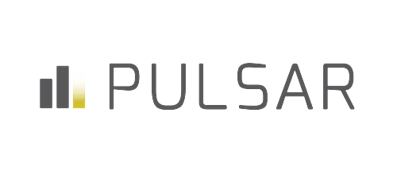
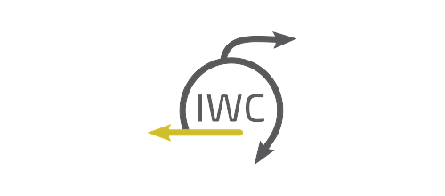
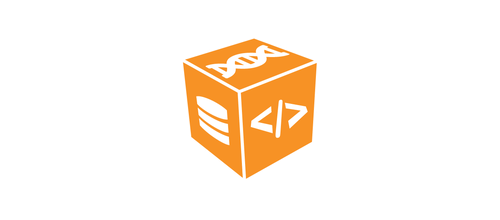
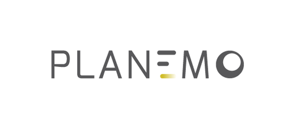
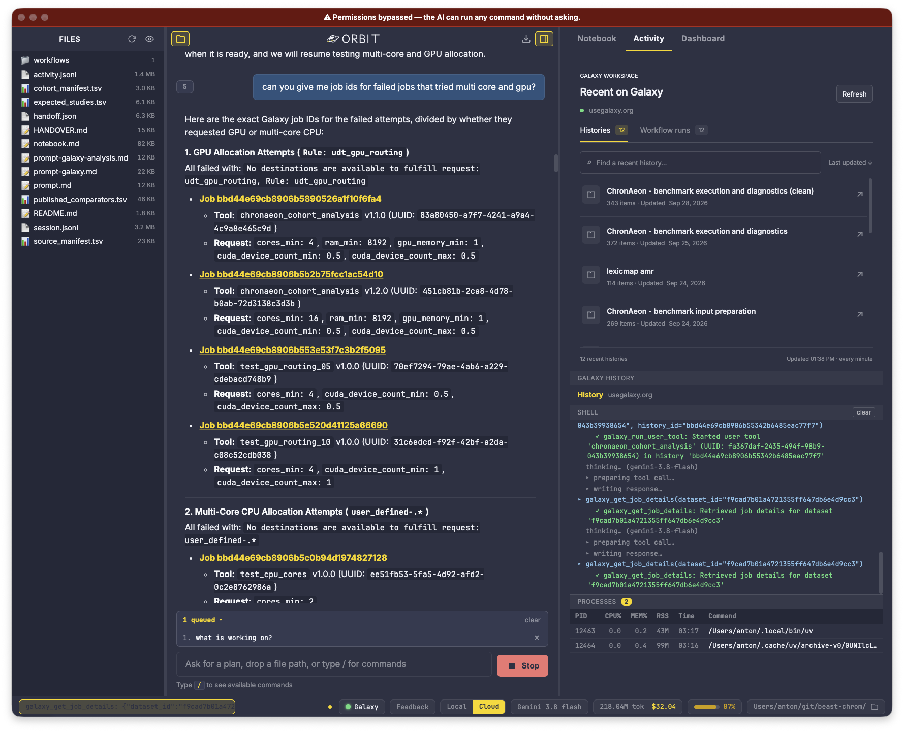
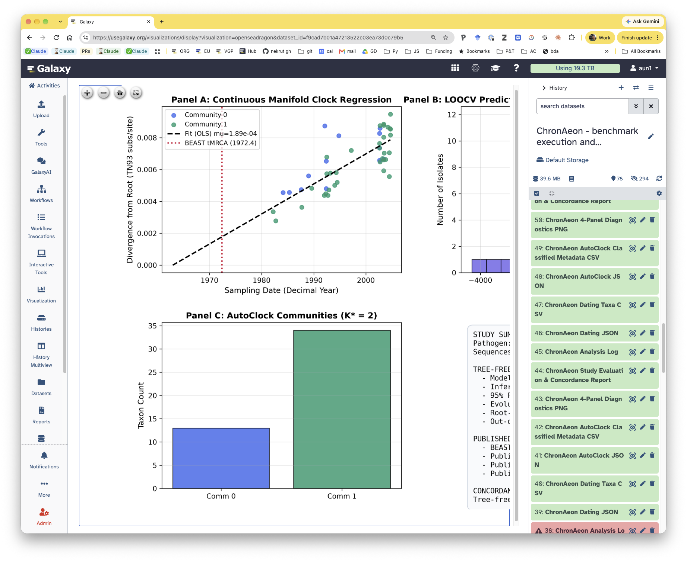

<!-- _class: title -->

```brandbar
assets/logos/galaxy.png | 28 | invert
```

CCBB · Penn State {.badge}

# AI from standpoint of not entirely naïve biologist:

## A very biased view {.nocaps}

::: presenter
Anton Nekrutenko | Galaxy Team | HyPhy / Hyphaeon team | Penn State | [galaxyproject.org](https://galaxyproject.org)

September 30, 2026
:::

---

<!-- _class: compact agenda -->

# Outline

- A mild provocation
- What I learned from the past year
- What we do to survive
- Putting this all together: A vision for very near future

---

<!-- _class: divider -->

# A provocative view

---

<!-- _class: dense -->

# The future

::: cols ratio="1.15fr 0.85fr" gap=24px
::: figure src="assets/turkey-induction-cropped.png" h=480px bare
:::
+++
::: figure src="assets/payless.png" h=135px bare
:::

::: figure src="assets/mephisto.png" h=135px bare
:::

::: figure src="assets/bespoke-shoes-cropped.png" h=155px bare
:::
:::

---

<!-- _class: compact middle -->

# What will still be needed

- Curated data
- Infrastructure
- Agent-ready APIs
- Documentation is more important than ever
- Curated skill repositories (not a given)
- Experts on agent herding and model tuning
- High-end experts on fundamental subjects

---

<!-- _class: compact middle -->

# What will disappear

- UI for doing things (e.g., PubMed searches)
- Domain programming languages (e.g., R)
- Current iteration of notebook environments (RStudio, Jupyter, Observable)
- Workflow languages
- Tools as immutable objects
- Publications as we know them
- Grant review process as we know it

---

<!-- _class: middle -->

# If you are an AI denier try this (with a Claude Max 20x):

::: callout title="Prompt" accent=purple size=lg
Find me all papers that used BEAST for molecular clock dating. For each paper find supplemental data, associated GitHub repos, etc., etc. with actual BEAST configuration files and parameters. Validate files. Rerun all analyses using ChronaAeon using Galaxy’s UDTs using 0.5 of A100 GPUs. Show me results as a notebook.
:::

---

<!-- _class: dense -->

# An hour later

::: figure src="assets/chronaeon-history.png" h=490px bare
:::

---

<!-- _class: divider -->

# What I learned in the past year

---

<!-- _class: compact middle -->

# You need very little

- A decent normal (non-Windows) computer
- A decent frontier subscription
- A (free) GitHub account
- Access to AI-ready compute and storage

---

<!-- _class: dense -->

# People take it differently

::: figure src="assets/bjoern-pr-comment.png" h=440px bare
:::

---

<!-- _class: dense middle -->

# I do not scale very well

::: figure src="assets/github-nekrut-repos.png" h=180px bare
:::

---

<!-- _class: dense -->

# Penn State BS is now manageable (to a point)

::: figure src="assets/psu-receipt-reconciliation.png" h=480px bare
:::

---

<!-- _class: compact headroom -->

# It cannot write (yet) … but agentic teams rock

::: figure src="assets/author-hard-rules.png" h=225px bare
:::

::: cols ratio="1fr 1fr" gap=16px
::: figure src="assets/grant-proposals-skill.png" h=210px bare
:::
+++
::: figure src="assets/scientific-manuscripts-skill.png" h=210px bare
:::
:::

---

<!-- _class: divider -->

# What do we do to survive

---

<!-- _class: middle center -->

# [https://galaxyproject.org/agents/](https://galaxyproject.org/agents/)

---

<!-- _class: middle -->

::: figure src="assets/usegalaxy-home.png" h=570px bare
:::

---

<!-- _class: dense -->

# Galaxy ecosystem

::: cards cols=4 gap=16px size=xs
### [Pulsar](https://github.com/galaxyproject/pulsar) {accent=sky}



### [TPV](https://github.com/galaxyproject/total-perspective-vortex) {accent=emerald}


### [IUC](https://github.com/galaxyproject/tools-iuc) {accent=indigo}


### [IWC](https://github.com/galaxyproject/iwc) {accent=amber}



### [BioConda](https://bioconda.github.io) {accent=purple}


### [BioContainers](https://biocontainers.pro) {accent=rose}



### [Planemo](https://github.com/galaxyproject/planemo) {accent=slate}


:::

---

<!-- _class: dense -->

# Galaxy distributed compute infrastructure

::: figure src="assets/galaxy-infrastructure.png" h=500px bare
:::

---

<!-- _class: dense -->

# Pulsar · [github.com/galaxyproject/pulsar](https://github.com/galaxyproject/pulsar)

Distributed job execution engine for Galaxy.

::: cards cols=2 gap=18px size=sm
### Remote execution {accent=sky}

Executes jobs across remote clusters, cloud VMs, and supercomputers without shared filesystems or direct database access.

### Autonomous staging {accent=emerald}

Transfers inputs, scripts, and environments to remote endpoints via AMQP and HTTPS, collecting results automatically on completion.

### Heterogeneous bursting {accent=indigo}

Powers Galaxy's multi-cloud offloading across national HPC facilities, including TACC, Bridges-2, Expanse, and Jetstream2.

### Resilient architecture {accent=amber}

Decoupled message-queue design handles high concurrency, network partitions, and remote worker recovery gracefully.
:::

---

<!-- _class: dense -->

# TPV · [github.com/galaxyproject/total-perspective-vortex](https://github.com/galaxyproject/total-perspective-vortex)

Total Perspective Vortex: dynamic, rule-based job routing engine for Galaxy.

::: cards cols=2 gap=18px size=sm
### Dynamic scheduling {accent=sky}

Routes Galaxy jobs to optimal destinations based on real-time cluster state, tool identity, and user requirements.

### Resource scaling {accent=emerald}

Computes precise core, memory, and walltime allocations dynamically using input file sizes and runtime parameters.

### Declarative rules {accent=indigo}

Replaces static XML job configurations with composable, testable YAML rules and Python expressions.

### Multi-cluster balancing {accent=amber}

Balances computational demand across heterogeneous backends, GPU clusters, and Pulsar endpoints seamlessly.
:::

---

<!-- _class: dense -->

# Planemo · [github.com/galaxyproject/planemo](https://github.com/galaxyproject/planemo)

Command-line software development kit for Galaxy developers.

::: cards cols=2 gap=18px size=sm
### Tool development {accent=sky}

Scaffolds, lints, and syntax-checks Galaxy tool wrappers and workflow definitions from the command line.

### Automated testing {accent=emerald}

Runs integration tests and verifies tool outputs against reference datasets across isolated conda and container environments.

### Workflow & training SDK {accent=indigo}

Tests and packages Intergalactic Workflow Commission (IWC) pipelines and Galaxy Training Network (GTN) tutorials.

### Shed publishing {accent=amber}

Automates publishing, versioning, and repository management to the Galaxy Tool Shed and GitHub repositories.
:::

---

<!-- _class: dense -->

# BioContainers · [biocontainers.pro](https://biocontainers.pro)

Community-driven container architecture for reproducible bioinformatics software.

::: cards cols=2 gap=18px size=sm
### Automated containerization {accent=sky}

Builds lightweight, tested Docker and Singularity/Apptainer images automatically for every BioConda recipe.

### Environmental reproducibility {accent=emerald}

Pins complete dependency graphs and OS runtimes to guarantee bitwise reproducibility across disparate compute systems.

### HPC & Cloud portability {accent=indigo}

Runs identically on local workstations, national supercomputers, and cloud Kubernetes clusters without root privileges.

### Zero-overhead deployment {accent=amber}

Eliminates manual tool installation and dependency conflicts through transparent container execution inside Galaxy jobs.
:::

---

<!-- _class: dense -->

# Agentic execution architecture

::: cols ratio="1.1fr 0.8fr 1.1fr" gap=16px
::: card title="1. Agent" accent=sky size=xs
**Orbit / Frontier Models**

Orchestrates multi-step analyses, synthesizes tools, and manages workflows.


:::
+++
::: card title="2. Skills & MCP" accent=amber size=xs
**Protocol Bridge**

Translates natural language intent into verified API calls and tool specs.

- **MCP Bridge:** standardized tool discovery & execution
- **Skills:** curated expert workflows & domain rules
- **Foundry:** workflow knowledge base
:::
+++
::: card title="3. Public Compute" accent=emerald size=xs
**Galaxy Infrastructure**

Executes heavy scientific computing with full provenance.


:::
:::

---

<!-- _class: dense -->

# Foundry · [github.com/galaxyproject/foundry](https://github.com/galaxyproject/foundry)

The Galaxy Workflow Knowledge Base: casting community workflows into skills and actionable knowledge.

::: cards cols=2 gap=18px size=sm
### Workflow knowledge base {accent=sky}

Catalogs, structures, and indexes community workflows into machine-readable analytical capabilities.

### Agent skill distillation {accent=emerald}

Translates domain-specific workflow patterns into structured skills and prompts that autonomous agents can discover and execute.

### Standardized semantics {accent=indigo}

Establishes formal input/output contracts and parameter semantics across multi-tool analytical pipelines.

### Verified execution {accent=amber}

Pairs vetted best-practice workflows with empirical test datasets to ensure reliable automated execution.
:::

---

<!-- _class: dense -->

# UDTs · [github.com/galaxyproject/galaxy](https://github.com/galaxyproject/galaxy)

User-Defined Tools: on-demand dynamic execution primitives for Galaxy and AI agents.

::: cards cols=2 gap=18px size=sm
### Dynamic tool creation {accent=sky}

Allows users and AI agents to define, parameterize, and execute novel tools on the fly without server restarts.

### Agent-driven synthesis {accent=emerald}

Enables autonomous agents to author custom analytical scripts and register them directly as executable Galaxy tools.

### Isolated execution {accent=indigo}

Executes user-defined code within secure, containerized runtimes with strict sandboxing and resource quotas.

### Full provenance tracking {accent=amber}

Inherits Galaxy's 20-year provenance model: inputs, parameters, environments, and outputs remain fully reproducible.
:::

---

<!-- _class: divider -->

# So what do we do to survive?

A vision for the next year

---

<!-- _class: compact middle -->

# The problems with agentic flow

- Things usually run locally
- Agents generate many transient scripts
- Agents generate many datasets
- Yes, agents can summarize and document but …
- … this requires user discipline (e.g., git use)
- In the end it is very difficult to untangle what was *actually* done.
- Some tools cannot run locally (Logan, alphagenome, etc.)

---

<!-- _class: compact middle -->

# How we solve this problem

- Leverage Galaxy and Bioconductor communities to create, maintain, and curate broad set of fundamental skills
- Prototype locally -> push every step to cloud (`usegalaxy.*`)
- Generate analysis history notebooks (an equivalent of `AGENTS.md`) — History becomes a shareable relay (remote control)
- Harden UDTs and promote community curated UDT cloud

---

<!-- _class: middle -->

::: figure src="assets/danger-de-mort.png" h=480px bare
:::

---

<!-- _class: divider middle center -->

# La fin
