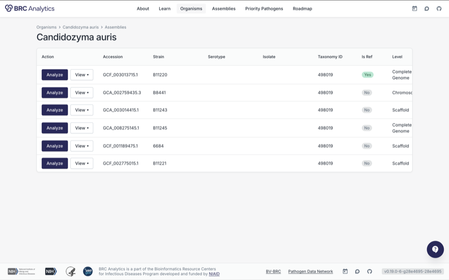
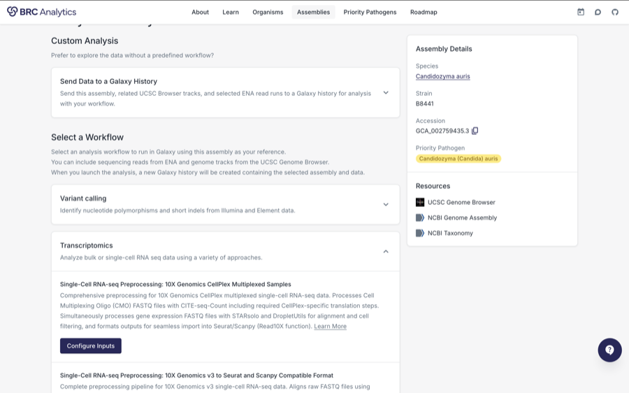
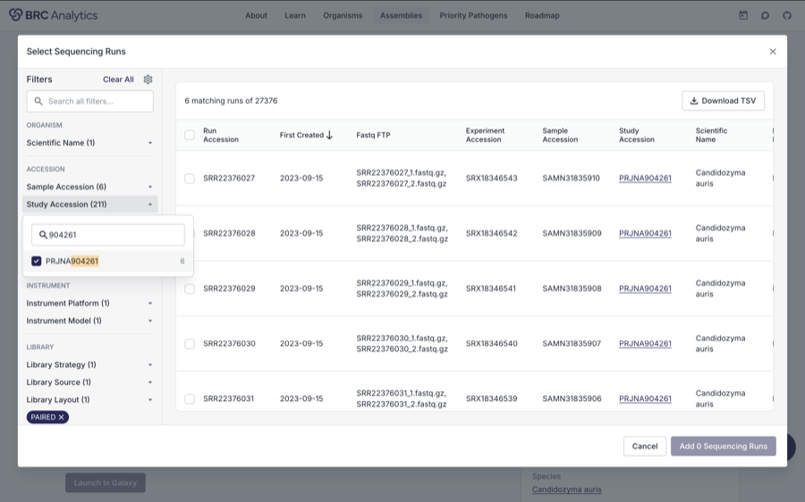
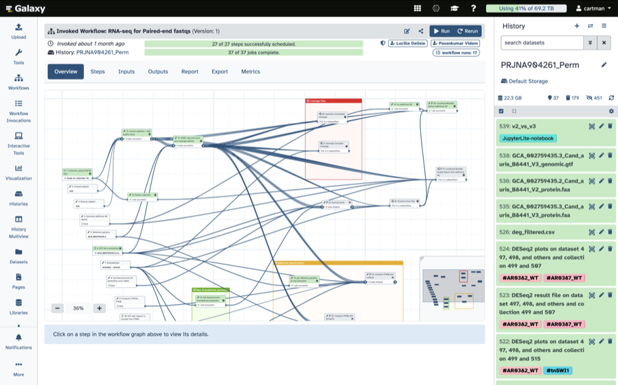
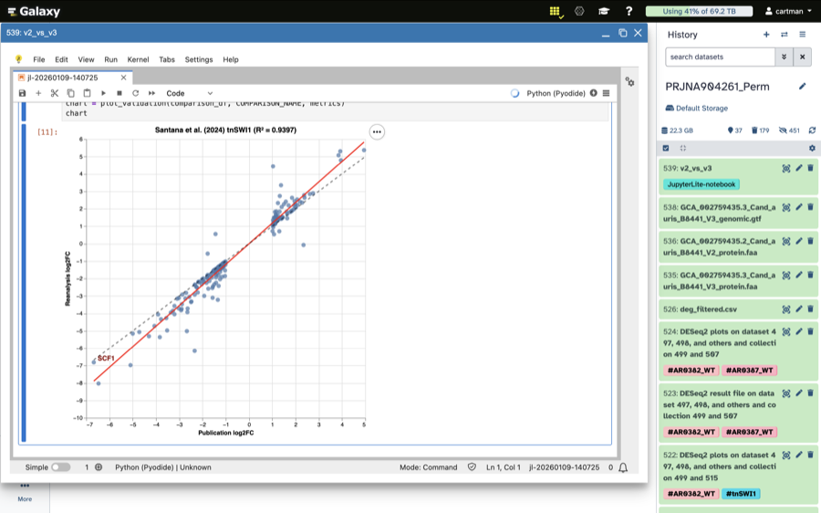

<!-- Adapted from asv2026/slides.md. 16 slides / 15 minutes. -->

<!-- _class: title -->

```brandbar
https://brc-analytics.org/logo/brc.svg | 28 | invert
```

ICOPA XVI {.badge}

# BRC-Analytics: Combining agentic AI with open infrastructure for pathogen genomics

## From reads to outbreak clusters {.nocaps}

::: presenter
Anton Nekrutenko | Penn State | [galaxyproject.org](https://galaxyproject.org)
:::

::: figure src="assets/qr/icopa26.svg" href="https://gxy.io/icopa26" bare .qr-pin
gxy.io/icopa26
:::

BRCs = BV-BRC ([bv-brc.org](https://www.bv-brc.org/)) + PDN ([pathogendatanetwork.org](https://pathogendatanetwork.org/)) + BRC-analytics ([brc-analytics.org](https://brc-analytics.org)) {.footnote}

---

<!-- _class: compact agenda -->

# Outline

A 15 min impossible challenge

- What is BRC-Analytics
- What is Galaxy
- A worked example: *Cyclospora* surveillance
- What are agentic analyses
- Teaser: searching the entire public archive

---

<!-- _class: compact middle bigtitle -->

# BRC-Analytics: data, tools, workflows, infrastructure

[brc-analytics.org](https://brc-analytics.org)

::: pillars brace="Agents" accent=amber size=xl
### Data {accent=sky}

NCBI Datasets · NCBI Virus · EBI · UCSC Genome Browser

### Tools + Workflows {accent=emerald}

BioConda · BioContainers · Workflows

### Compute and Storage {accent=indigo}

TACC · IU JetStream2 · ACCESS-CI
:::

---

<!-- _class: compact middle -->

# Most of the catalogue is eukaryotic

1,975 taxa and 5,506 annotated assemblies — of which **449 taxa** are parasitic protists, helminths or arthropod vectors

```bars accent=indigo unit="taxa" wide
Nematoda | 115 | 196 assemblies — *Strongyloides*, *Trichinella*, *Meloidogyne* | accent=emerald
Arthropoda (vectors) | 97 | 181 assemblies — *Anopheles*, *Aedes*, *Glossina*, ticks | accent=amber
Apicomplexa | 72 | 267 assemblies — *Plasmodium*, *Cryptosporidium*, *Babesia*, *Eimeria* | accent=rose
Microsporidia | 51 | 92 assemblies — *Encephalitozoon*, *Nematocida* | accent=purple
Platyhelminthes | 39 | 55 assemblies — *Schistosoma*, *Echinococcus*, *Taenia* | accent=sky
Kinetoplastea | 39 | 115 assemblies — *Leishmania*, *Trypanosoma* | accent=indigo
Amoebozoa | 28 | 40 assemblies — *Acanthamoeba*, *Entamoeba*, *Balamuthia* | accent=slate
Metamonada | 8 | 43 assemblies — *Giardia*, *Trichomonas*, *Histomonas* | accent=navy
```

Also in the catalogue: 681 fungi, 457 viruses, 323 bacteria, 24 oomycetes. Counts from the live catalogue, 18 Aug 2026. {.footnote}

---

<!-- _class: micro -->

# BRC-Analytics flow

[brc-analytics.org](https://brc-analytics.org)

::: cards cols=3 gap=14px size=xs thumb=120px
### Find organism {tag="1" accent=sky}

Pick from 1,975 taxa.


### Select genome {tag="2" accent=emerald}

Choose among 5,506 assemblies.



### Select workflow {tag="3" accent=indigo}

Best-practice, community-maintained.



### Select data {tag="4" accent=amber}

Anything in the SRA, or your own.



### Run workflow {tag="5" accent=purple}

One sample or a million.



### Interpret {tag="6" accent=rose}

Inspect, iterate, publish.


:::

---

<!-- _class: compact middle -->

# Workflows that run on a eukaryotic pathogen

Community-maintained, also at [iwc.galaxyproject.org](https://iwc.galaxyproject.org/)

::: cards cols=3 gap=16px size=md minh=180px
### Ploidy-aware variant calling {tag="Variation" accent=sky}

Paired-end calling and genotyping that does not assume a haploid genome — for diploid vectors and mixed infections.

### Genome annotation with Braker3 {tag="Annotation" accent=emerald}

Eukaryote-specific structural annotation; `lncRNA` annotation alongside it.

### RNA-Seq quantification {tag="Transcriptomics" accent=indigo}

Paired- and single-end processing, through to counts — plus single-cell preprocessing.

### Assembly with Flye + polishing {tag="Assembly" accent=amber}

Long-read assembly and long-read polishing, for organisms with no reference-grade genome.

### Hi-C to balanced cool files {tag="Regulation" accent=purple}

Scaffolding and chromatin contact maps; ATAC-seq and CUT&RUN in the same family.

### Bring your own {tag="Anything" accent=rose}

Any Galaxy workflow runs here — including the *Cyclospora* typing panel in the next three slides.
:::

---

<!-- _class: micro -->

# Galaxy is a free public resource and it scales

[https://galaxyproject.org](https://galaxyproject.org)

::: cols ratio="1.45fr 0.55fr" gap=26px
::: figure src="images/nature-covid19-infrastructure.png" href="https://www.nature.com/articles/s41587-021-01069-1" h=470px
:::

+++

```stats cols=1 .tight
750,000 | jobs per month | accent=sky
400,000+ | registered users | accent=emerald
1,500 | concurrent users | accent=indigo
$2,000,000+ | free compute / year | accent=amber
10,000+ | analysis tools | accent=purple
22,000+ | citations | accent=rose
```
:::

---

<!-- _class: micro -->

# Get data, run tools, run workflows, interpret

::: cols cols=2 gap=16px max=790px
::: figure src="assets/galaxy/upload.png" h=226px bare
**1 · Get your data** — computer, web, SRA, anywhere
:::

+++

::: figure src="assets/galaxy/run-tool.png" h=226px bare
**2 · Run a tool** — select from 1,000s of tools
:::

+++

::: figure src="assets/galaxy/run-wf.png" h=226px bare
**3 · Or run a workflow** — 100s of curated workflows
:::

+++

::: figure src="assets/galaxy/interpret.png" h=226px bare
**4 · Interpret and publish** — Jupyter, RStudio, soon agents
:::
:::

---

<!-- _class: dense -->

# Worked example: *Cyclospora cayetanensis*

The public data is 99.6% one assay

```stats cols=4
9,054 | public SRA runs | the entire archive | accent=sky
9,016 | CDC 8-marker amplicon | 99.6% of all runs | accent=amber
38 | whole-genome runs | worldwide | accent=rose
49 | assemblies | median 1,391 contigs | accent=slate
```

::: figure src="assets/cyc/genome_quality.png" h=338px bare
:::

---

<!-- _class: compact middle -->

# A labelled outbreak benchmark, public and unused

CDC's own typing repository ships epidemiologic cluster labels for the 2018 US outbreaks

::: cards cols=2 gap=18px size=md minh=185px
### 203 specimens, two traceback clusters {tag="Ground truth" accent=emerald}

BioProject `PRJNA578931`, 10.3 GB of reads. **Vendor A** (salads) n=99; **Vendor B** (vegetable trays) n=104.

Labels come from food-exposure traceback — assigned independently of sequence.

### The join nobody had made {tag="Linkage" accent=sky}

All 203 specimens connect to public SRA runs through the BioSample `Sample Alias` field.

That turns the largest *Cyclospora* dataset on Earth from unlabelled reads into a supervised clustering benchmark.
:::

::: cols ratio="1fr 1fr" gap=16px
::: box .box-inline accent=amber size=md
**Geography is recoverable.** CDC BioSamples report only `geo_loc_name=USA`, but the sample names encode submitting state and specimen year — **41 states across 2018–2025**.
:::

+++

::: box .box-inline accent=indigo size=md
**Reference files pinned by DOI.** Markers, PART windows, 78 named haplotypes and the junction windows: [`10.5281/zenodo.21924355`](https://doi.org/10.5281/zenodo.21924355) — CDC's release, redeposited CC0.
:::
:::

---

<!-- _class: dense -->

# The panel, as a Galaxy workflow

11 steps; 153 specimens fan out into 615 jobs

::: cols ratio="1.15fr 0.85fr" gap=18px stretch
::: figure src="assets/cyc/galaxy_workflow.png" h=440px bare
:::

+++

::: card title="It reproduces the local analysis" accent=emerald border=top size=md
| | local | Galaxy |
| --- | --- | --- |
| junction precision | 1.000 | 1.0000 |
| junction recall | 0.971 | 0.9712 |
| PART precision | 0.9150 | 0.9150 |
| PART recall | 0.9145 | 0.9145 |

Haplotype sheet byte-identical; distance matrices agree to 2.6 × 10⁻¹⁰, with 0 of 23,409 cells differing.
:::
:::

Numbers from the A1 benchmark, August 2026 — preprint in preparation. {.footnote}

---

<!-- _class: compact middle -->

# What the open pipeline changes

Not discrimination — determinism, retention and speed

::: cards cols=3 gap=16px size=md minh=200px
### Specimens retained {tag="Retention" accent=emerald}

CDC's retention rule keeps **67 of 153** on CDC's own calls.

Run on the open pipeline's calls, the same rule keeps **147 of 153** — and **195 of 203** — because the open caller types loci CDC left blank.

### Junction rescue {tag="Coverage" accent=sky}

The mitochondrial junction is called in **128 of 153** specimens, against CDC's 103.

**27 specimens typed that CDC left blank**, with 0 disagreements among the 101 both call.

### Determinism and speed {tag="Engineering" accent=amber}

Rerun on identical input, the legacy ensemble differs in **66.8%** of matrix cells; the open engine is byte-identical.

**1.6 s** against 370–655 s.
:::

::: note accent=slate
**Stated plainly:** on raw pairwise discrimination the legacy CDC metric is still ahead — ROC AUC **0.9964** against **0.7692** on the same sheet. And this benchmark is easy in a measurable way: single loci separate the two vendors outright. The gain here is reproducibility and sample retention, not accuracy.
:::

---

<!-- _class: micro -->

# The future is agentic

AI is an environmental and social disaster — but used responsibly it could be very good for science. **Orbit** is a BRC-Analytics / Galaxy agent.

```embed src="assets/orbit-demo.html" w=1300px scale=0.80 h=485px
```

---

<!-- _class: compact middle -->

# We need testers!

You will be given API keys to frontier models!

::: figure src="assets/qr/testers.svg" h=455px bare
[forms.gle/W93iF3L6ypjCvcYQ6](https://forms.gle/W93iF3L6ypjCvcYQ6)
:::

---

<!-- _class: micro -->

# One last thing: the entire public archive is searchable

**Logan** — every public SRA accession reassembled; queryable from Galaxy, and soon from BRC-Analytics directly

```stats cols=4
38M | accessions | 99.5% of SRA by size | accent=emerald
87 Pbp | raw reads in | Dec 2025 freeze | accent=sky
8.5 Pbp | unitigs out | k=31, near-lossless | accent=indigo
4 s | median query | one index · 186 Galaxy jobs | accent=amber
```

::: cols ratio="1fr 1fr 1.05fr" gap=16px stretch
::: card title="What it is" accent=emerald border=top size=sm
Every public SRA accession reassembled into **unitigs** — near-lossless, best for search — and **contigs** — error-corrected, best for alignment.

[Read more here](https://www.biorxiv.org/content/10.1101/2024.07.30.605881v2)
:::

+++

::: card title="How to query it" accent=sky border=top size=sm
- [`kmindex_query`](https://usegalaxy.org/?tool_id=toolshed.g2.bx.psu.edu/repos/iuc/kmindex/kmindex_query/0.6.1+galaxy3) on [usegalaxy.org](https://usegalaxy.org) — median **4 s** against one index, **8.4 min** against all of them.
- `LexicMap` on [usegalaxy.eu](https://usegalaxy.eu) — alignment-based, for longer queries.
- Or at [logan-search.org](https://logan-search.org).
:::

+++

::: card title="What a search turned up" accent=amber border=top size=sm
*Cyclospora* 28S rRNA in **3 clinical stool runs** annotated as something else — a Bangladeshi cholera cohort and two UK gastroenteritis metatranscriptomes.

But a k-mer scan of 421 stool metagenomes from ten endemic countries and 200 wastewater metagenomes found **none**. Both results are preliminary.
:::
:::

---

<!-- _class: compact -->

# Thank you!

::: cols ratio="0.85fr 0.4fr 1.05fr" gap=16px stretch
::: card title="People A to Z" accent=emerald size=lg
Artem Babayan, Dannon Baker, Kelsey Beavers, Danielle Callan, Rayan Chikhi, Nate Coraor, John Davis, Björn Grüning, Teo Lemane, Wolfgang Maier, Pierre Peterlongo, Sergei Pond, Dave Rogers, Marius Van Den Beek

The *Cyclospora* panel, its nomenclature and the 2018 cluster labels are CDC's work, released CC0.
:::

+++

::: card title="Funding" accent=sky size=lg
NIH NIAID

NIH NHGRI
:::

+++

::: card title="Links!" accent=indigo size=lg
- [brc-analytics.org](https://brc-analytics.org) — Data, workflows, compute
- [galaxyproject.org](https://galaxyproject.org) — Project home
- [usegalaxy.org](https://usegalaxy.org) — US
- [usegalaxy.eu](https://usegalaxy.eu) — EU
- [usegalaxy.org.au](https://usegalaxy.org.au) — Australia
- [training.galaxyproject.org](https://training.galaxyproject.org) — Galaxy Training Network
:::
:::

::: box .box-inline accent=slate size=md
**Find me at ICOPA:** [anton@nekrut.org](mailto:anton@nekrut.org)
:::

::: figure src="assets/qr/icopa26.svg" href="https://gxy.io/icopa26" h=122px bare .qr-pin
gxy.io/icopa26
:::

BRCs = BV-BRC ([bv-brc.org](https://www.bv-brc.org/)) + PDN ([pathogendatanetwork.org](https://pathogendatanetwork.org/)) + BRC-analytics ([brc-analytics.org](https://brc-analytics.org)) {.footnote}
